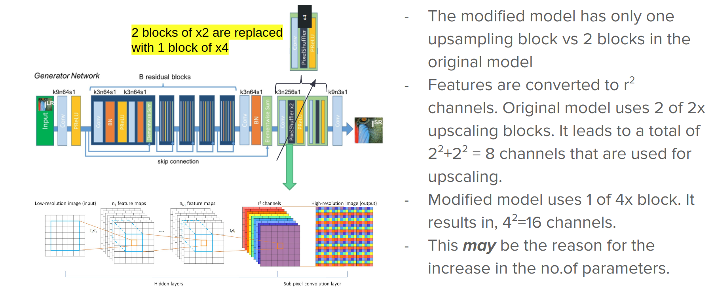
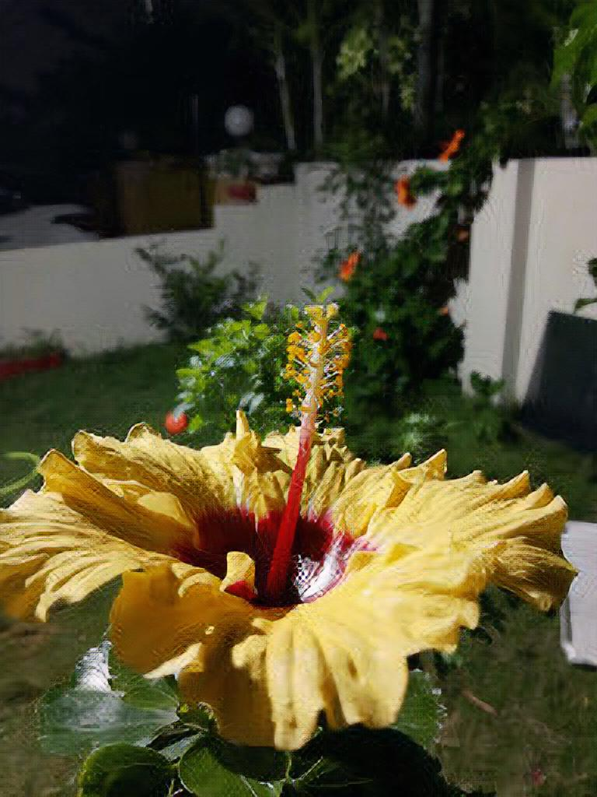
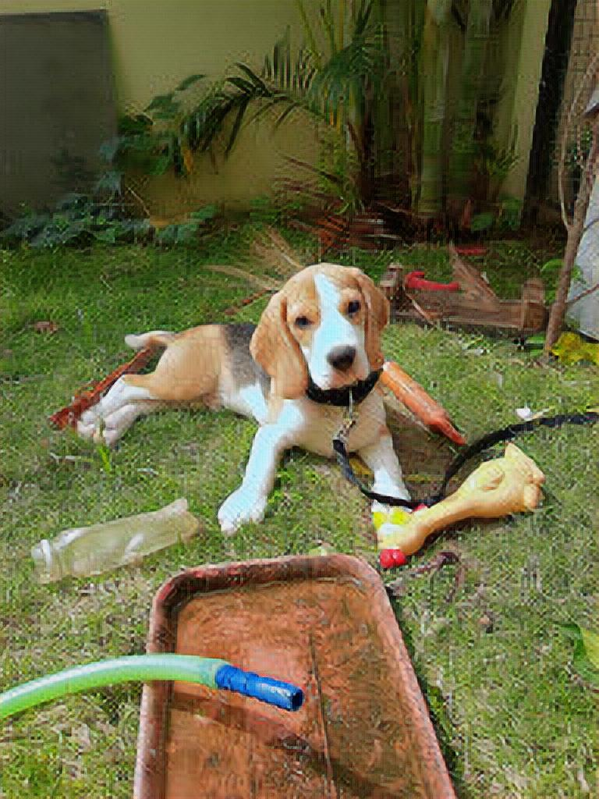
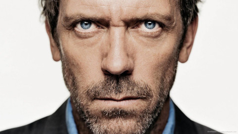
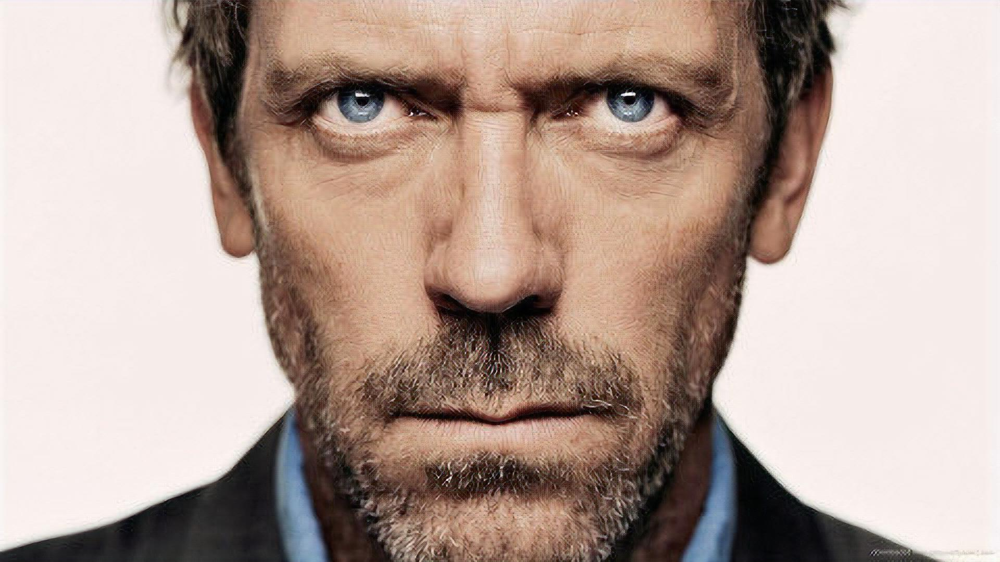

# SISR using deep learning

- This is an implementation of [Photo-Realistic Single Image Super-Resolution Using a Generative Adversarial Network](https://arxiv.org/abs/1609.04802).

- The code is taken from [left-thomas's implementation of SRGAN](https://github.com/leftthomas/SRGAN).

- I explore different image super resolution techniques and try to compare them. (Only ESRGAN ans SRGAN's results are uploaded to github).

- Trained SRGAN using google colab. Hence could not use a lot of images for training.

- Tried to modify the network to be able to take in any upscale value (not fractional), intead having only exponentials of 2 as is in the paper.
Noticed that the modifictaion resulted in more number of parameters than the original model, for upscale values like 4,6,8 etc.

- This is my understanding of why it happened:

- Some results from the trained model

modified SRGAN model, trained for 930 epochs:

input : 

output:  PSNR:27.07

----------

input : 

output:  PSNR:20.50

----------

input : 

output:  PSNR:28.57

----------

Pre-trained ESRGAN:

input : 

output: 

